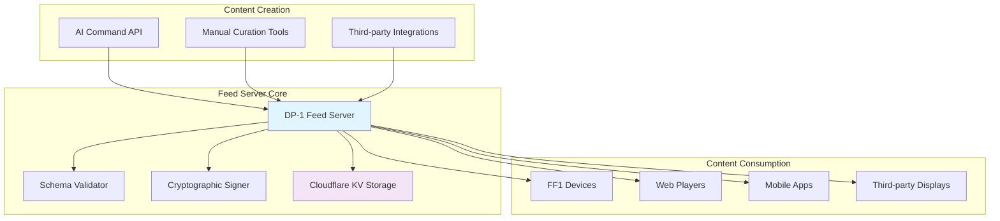
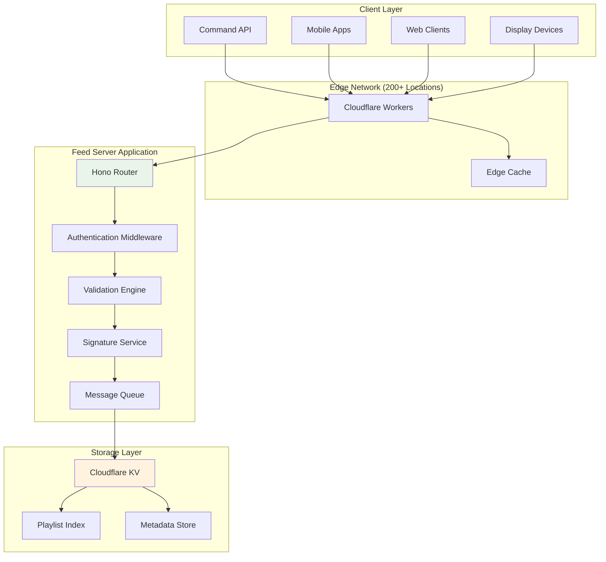

# DP-1 Feed Server

*A comprehensive guide to the DP-1 Feed Server - the central registry for playlist storage, validation, and distribution in the Display Protocol ecosystem*

---

## Overview

The DP-1 Feed Server is the backbone infrastructure of the Display Protocol (DP-1) ecosystem, serving as the authoritative registry for digital art playlists. Built on modern web technologies and deployed on Cloudflare's edge network, it provides a robust, scalable, and globally distributed platform for storing, validating, and serving DP-1 compliant playlists to display clients worldwide.

### What is the Feed Server?

The Feed Server is a specialized web service that acts as the central hub for playlist management in the DP-1 protocol. It bridges the gap between content creation (through AI-powered commands or manual curation) and content consumption (on display devices like FF1 or other DP-1 compatible clients).

**Key Functions:**

- **Playlist Registry**: Stores and indexes DP-1 compliant playlists with unique identifiers
- **Schema Validation**: Ensures all playlists conform to DP-1 specifications before storage
- **Cryptographic Security**: Signs playlists with Ed25519 signatures for tamper-proof authenticity
- **Global Distribution**: Leverages Cloudflare's edge network for low-latency worldwide access
- **API Gateway**: Provides RESTful endpoints for playlist CRUD operations and retrieval

### Role in the DP-1 Ecosystem

The Feed Server operates at the intersection of several critical components:



---

## Technical Architecture

### Core Technology Stack

The DP-1 Feed Server is built using modern, edge-optimized technologies:

**Runtime Environment:**

- **[Hono](https://hono.dev/)** - Ultra-fast web framework optimized for edge computing
- **Cloudflare Workers** - Serverless execution environment with global distribution
- **TypeScript** - Type-safe development with excellent tooling support

**Storage & Infrastructure:**

- **Cloudflare KV** - Global key-value store for playlist data
- **Edge Caching** - Automatic caching at 200+ global locations
- **CDN Integration** - Seamless content delivery optimization

**Security & Validation:**

- **Ed25519 Cryptography** - Digital signatures for playlist authenticity
- **JSON Schema Validation** - Strict compliance with DP-1 specifications
- **API Key Authentication** - Secure access control for write operations

### System Architecture



### Data Flow

1. **Playlist Submission**: Clients submit playlists via HTTP POST to `/playlists`
2. **Authentication**: API keys are validated against authorized client list
3. **Schema Validation**: Playlists are validated against DP-1 JSON schema
4. **Cryptographic Signing**: Valid playlists receive Ed25519 signatures
5. **Immediate Response**: API returns playlist data immediately for seamless user experience
6. **Asynchronous Persistence**: Message queue handles background storage to Cloudflare KV *(experimental)*
7. **Global Distribution**: Playlists become available globally via edge cache
8. **Retrieval**: Clients fetch playlists using GET `/playlists/{id}` endpoints

**Performance Optimization:**
To improve API latency, especially for large dataset playlists, the Feed Server employs a message queue system for asynchronous data persistence. This approach enables players to display playlists immediately after creation without waiting for the persistence operation to complete. The playlist data is eventually stored and distributed globally through Cloudflare Workers. *Note: The message queue approach is currently experimental and under active development.*

---

## API Reference

The Feed Server provides a RESTful API for playlist management and retrieval. All endpoints follow standard HTTP conventions and return JSON responses.

### Base URL

```
https://feed.feralfile.com/api/v1
```

### Authentication

Write operations require API key authentication via the `Authorization` header:

```bash
curl -H "Authorization: Bearer your-api-key-here" \
     -H "Content-Type: application/json" \
     -X POST https://feed.feralfile.com/api/v1/playlists \
     -d @playlist.json
```

### Endpoints

#### Create Playlist

**POST** `/playlists`

Creates a new playlist with automatic validation and signing.

**Request Headers:**

- `Content-Type: application/json`
- `Authorization: Bearer <your-api-key>` (required)

**Request Body:**
```json
{
  "dpVersion": "1.0.0",
  "title": "Digital Art Showcase",
  "defaults": {
    "display": {
      "scaling": "contain",
      "background": "#000000",
      "margin": 0
    }
  },
  "items": [
    {
      "duration": 30,
      "license": "open",
      "source": "ipfs://cid",
      "provenance": {
        "type": "onChain",
        "contract": {
          "chain": "ethereum",
          "standard": "ERC-721",
          "address": "0x...",
          "tokenId": "1"
        }
      }
    }
  ]
}
```

**Response (201 Created):**
```json
{
  "dpVersion": "1.0.0",
  "id": "d241c5ad-a5e0-451e-89ec-de442811a869",
  "slug": "digital-art-showcase-ds2",
  "title": "Digital Art Showcase",
  "created": "2025-08-11T08:49:14.454Z",
  "defaults": {
    "display": {
      "scaling": "contain",
      "background": "#000000",
      "margin": 0
    }
  },
  "items": [
    {
      "duration": 30,
      "license": "open",
      "source": "ipfs://cid",
      "provenance": {
        "type": "onChain",
        "contract": {
          "chain": "ethereum",
          "standard": "ERC-721",
          "address": "0x...",
          "tokenId": "1"
        }
      },
      "id": "732dc2a2-9597-4b91-b4b1-debc761f7fdd",
      "created": "2025-09-04T09:23:25.526Z"
    }
  ],
  "signature": "ed25519:0xabc..."
}
```

**Error Responses:**

- `400 Bad Request` - Invalid playlist format or missing required fields
- `401 Unauthorized` - Missing or invalid API key
- `500 Internal Server Error` - Internal server error

#### Replace Playlist

**PUT** `/playlists/{id}`

Replace an existing playlist with automatic validation and signing.

**Request Headers:**

- `Content-Type: application/json`
- `Authorization: Bearer <your-api-key>` (required)

**Request Body:**
```json
{
  "dpVersion": "1.0.0",
  "title": "Digital Art Showcase",
  "defaults": {
    "display": {
      "scaling": "contain",
      "background": "#000000",
      "margin": 0
    }
  },
  "items": [
    {
      "duration": 30,
      "license": "open",
      "source": "ipfs://cid",
      "provenance": {
        "type": "onChain",
        "contract": {
          "chain": "ethereum",
          "standard": "ERC-721",
          "address": "0x...",
          "tokenId": "1"
        }
      }
    }
  ]
}
```

**Response (200 OK):**
```json
{
  "dpVersion": "1.0.0",
  "id": "d241c5ad-a5e0-451e-89ec-de442811a869",
  "slug": "digital-art-showcase-ds2",
  "title": "Digital Art Showcase",
  "created": "2025-08-11T08:49:14.454Z",
  "defaults": {
    "display": {
      "scaling": "contain",
      "background": "#000000",
      "margin": 0
    }
  },
  "items": [
    {
      "duration": 30,
      "license": "open",
      "source": "ipfs://cid",
      "provenance": {
        "type": "onChain",
        "contract": {
          "chain": "ethereum",
          "standard": "ERC-721",
          "address": "0x...",
          "tokenId": "1"
        }
      },
      "id": "732dc2a2-9597-4b91-b4b1-debc761f7fdd",
      "created": "2025-09-04T09:23:25.526Z"
    }
  ],
  "signature": "ed25519:0xabc..."
}
```

**Error Responses:**

- `400 Bad Request` - Invalid playlist format or missing required fields
- `401 Unauthorized` - Missing or invalid API key
- `500 Internal Server Error` - Internal server error

#### Update Playlist

**PATCH** `/playlists/{id}`

Update an existing playlist with automatic validation and signing.

**Request Headers:**

- `Content-Type: application/json`
- `Authorization: Bearer <your-api-key>` (required)

**Request Body:**
```json
{
  "title": "Digital Art Showcase",
  "defaults": {
    "display": {
      "scaling": "contain",
      "background": "#000000",
      "margin": 0
    }
  }
}
```

**Response (200 OK):**
```json
{
  "dpVersion": "1.0.0",
  "id": "d241c5ad-a5e0-451e-89ec-de442811a869",
  "slug": "digital-art-showcase-ds2",
  "title": "Digital Art Showcase",
  "created": "2025-08-11T08:49:14.454Z",
  "defaults": {
    "display": {
      "scaling": "contain",
      "background": "#000000",
      "margin": 0
    }
  },
  "items": [
    {
      "duration": 30,
      "license": "open",
      "source": "ipfs://cid",
      "provenance": {
        "type": "onChain",
        "contract": {
          "chain": "ethereum",
          "standard": "ERC-721",
          "address": "0x...",
          "tokenId": "1"
        }
      },
      "id": "732dc2a2-9597-4b91-b4b1-debc761f7fdd",
      "created": "2025-09-04T09:23:25.526Z"
    }
  ],
  "signature": "ed25519:0xabc..."
}
```

**Error Responses:**

- `400 Bad Request` - Invalid playlist format or missing required fields or update protected fields.
- `401 Unauthorized` - Missing or invalid API key
- `500 Internal Server Error` - Internal server error

#### Retrieve Playlist

**GET** `/playlists/{id}`

Retrieves a playlist by its unique identifier.

**Parameters:**
- `id` (path) - Playlist identifier (e.g., `d241c5ad-a5e0-451e-89ec-de442811a869` or `digital-art-showcase-ds2`)

**Response (200 OK):**
```json
{
  "dpVersion": "1.0.0",
  "id": "d241c5ad-a5e0-451e-89ec-de442811a869",
  "slug": "digital-art-showcase-ds2",
  "title": "Digital Art Showcase",
  "created": "2025-08-11T08:49:14.454Z",
  "defaults": {
    "display": {
      "scaling": "contain",
      "background": "#000000",
      "margin": 0
    }
  },
  "items": [
    {
      "duration": 30,
      "license": "open",
      "source": "ipfs://cid",
      "provenance": {
        "type": "onChain",
        "contract": {
          "chain": "ethereum",
          "standard": "ERC-721",
          "address": "0x...",
          "tokenId": "1"
        }
      },
      "id": "732dc2a2-9597-4b91-b4b1-debc761f7fdd",
      "created": "2025-09-04T09:23:25.526Z"
    }
  ],
  "signature": "ed25519:0xabc..."
}
```

**Error Responses:**

- `400 Bad Request` - Playlist identifier format is invalid
- `404 Not Found` - Playlist does not exist
- `500 Internal Server Error` - Server error during retrieval

#### List Playlists

**GET** `/playlists`

Returns a paginated list of playlist metadata.

**Query Parameters:**

- `limit` (optional) - Number of results per page (default: 100, max: 100)
- `cursor` (optional) - cursor point to the first item of the next page
- `sort` (optional) - Sort order for creation time: `asc` or `desc` (default: `asc`)

**Response (200 OK):**
```json
{
  "playlists": [
    {
      "dpVersion": "1.0.0",
      "id": "d241c5ad-a5e0-451e-89ec-de442811a869",
      "slug": "digital-art-showcase-ds2",
      "title": "Digital Art Showcase",
      "created": "2025-08-11T08:49:14.454Z",
      "items": [
        {
          "duration": 30,
          "license": "open",
          "source": "ipfs://cid",
          "id": "732dc2a2-9597-4b91-b4b1-debc761f7fdd",
          "created": "2025-09-04T09:23:25.526Z"
        }
      ],
      "signature": "ed25519:0xabc..."
    }
  ],
  "cursor": "cursor",
  "hasMore": true
}
```

#### Health Check

**GET** `/health`

Returns server status and version information.

**Response (200 OK):**
```json
{
  "status": "healthy",
  "timestamp": "2025-09-08T07:36:30.348Z",
  "version": "1.0.0",
  "environment": "development",
  "runtime": "cloudflare-worker"
}
```

---

## Implementation Details

### Playlist Validation

The Feed Server implements comprehensive validation to ensure all stored playlists comply with DP-1 specifications:

#### Schema Validation Process

1. **Structure Validation**: Verifies JSON structure matches DP-1 schema
2. **Required Fields**: Ensures all mandatory fields are present
3. **Data Types**: Validates field types (strings, numbers, arrays, objects)
4. **Format Constraints**: Checks formats for URLs, timestamps, and identifiers
5. **Business Rules**: Applies DP-1 specific validation rules

#### Validation Rules

**Playlist Level:**

- `dpVersion` must be a valid semantic version (e.g., "1.0.0")
- `items` array must contain at least one item
- `defaults.display` settings must be valid display parameters

**Item Level:**

- `duration` must be a positive integer (seconds)
- `license` must be one of: `open`, `token`, `subscription`
- `provenance` must include valid blockchain or off-chain metadata

#### Error Handling

Validation errors return detailed messages to help developers fix issues:

```json
{
  "error": "validation_error",
  "message": "Invalid playlist update data: items.0.source: Required; items.0.duration: Number must be greater than or equal to 1; items.0.license: Required" 
}
```

### Cryptographic Signing

Every playlist stored in the Feed Server receives a cryptographic signature to ensure authenticity and prevent tampering.

#### Signing Process

1. **Canonical JSON**: Playlist is serialized to canonical JSON format follow the [RFC 8785](https://www.rfc-editor.org/rfc/rfc8785)
2. **Hash Generation**: SHA-256 hash is computed from canonical representation
3. **Ed25519 Signature**: Hash is signed using server's private key
4. **Signature Encoding**: Signature is encoded as `ed25519:<hex>` format

#### Signature Verification

Clients can verify playlist authenticity by:

1. Removing the `signature` field from the playlist
2. Computing canonical JSON hash
3. Verifying signature against Feed Server's public key

### Storage Architecture

The Feed Server uses Cloudflare KV for globally distributed storage with automatic replication and edge caching.

#### Storage Strategy

**Playlist Storage:**

- **Key Format**: `playlist:{id}` or `playlist:{slug}` (e.g., `playlist:d241c5ad-a5e0-451e-89ec-de442811a869`)
- **Value**: Complete signed playlist JSON
- **TTL**: No expiration (permanent storage)

**Index Storage:**

- **Key Format**: `playlist:created:asc:{timestamp}:{id}` or `playlist:created:desc:{timestamp}:{id}`
- **Value**: Playlist ID for listing operations
- **Purpose**: Enables efficient pagination and sorting

---

## Development & Deployment

The DP-1 Feed Server supports two deployment options:

- **Cloudflare Workers**: Edge deployment with global distribution and integrated KV storage
- **Self-Hosted**: Docker Compose deployment for on-premises or custom hosting environments

For comprehensive development setup, deployment instructions, environment configuration, and contribution guidelines, refer to the [DEVELOPMENT.md](https://github.com/display-protocol/dp1-feed/blob/main/DEVELOPMENT.md) guide in the project repository.

---

## Conclusion

The DP-1 Feed Server represents a critical infrastructure component in the Display Protocol ecosystem, providing a robust, scalable, and secure platform for digital art playlist management. Built on modern edge computing technologies and designed for global distribution, it enables seamless integration between content creation and consumption across diverse display systems.

### Key Takeaways

- **Centralized Registry**: The Feed Server serves as the authoritative source for DP-1 compliant playlists
- **Global Distribution**: Cloudflare's edge network ensures low-latency access worldwide
- **Security First**: Ed25519 cryptographic signatures guarantee playlist authenticity
- **Developer Friendly**: RESTful APIs and comprehensive documentation enable easy integration
- **Open Source**: Community-driven development welcomes contributions and customizations

### Next Steps

To get started with the DP-1 Feed Server:

1. **Explore the API**: Try the endpoints using the provided examples
2. **Deploy Your Instance**: Follow the deployment guide for your preferred environment (Cloudflare or self-hosted)
3. **Integrate with Your Application**: Use the RESTful API endpoints in your applications
4. **Development**: Refer to the [GitHub repository](https://github.com/display-protocol/dp1-feed) for contribution guidelines and development setup

For more information, visit the [DP-1 Protocol documentation](https://github.com/display-protocol/dp1/blob/main/docs/spec.md) or explore related components:

- [Player Behavior](player-behavior.md) - How display clients interpret playlists
- [Schema Overview](overview-schemas.md) - Detailed DP-1 specification

The Display Protocol ecosystem continues to evolve, and the Feed Server remains at its core, enabling new possibilities for digital art distribution and display innovation.
