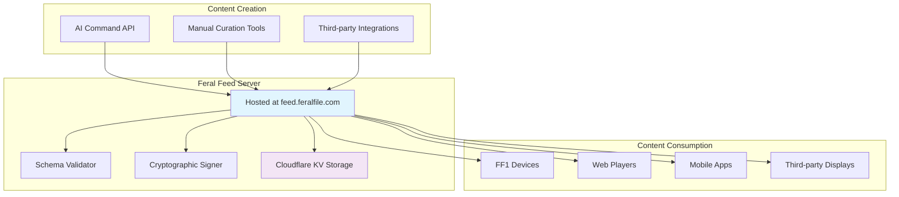
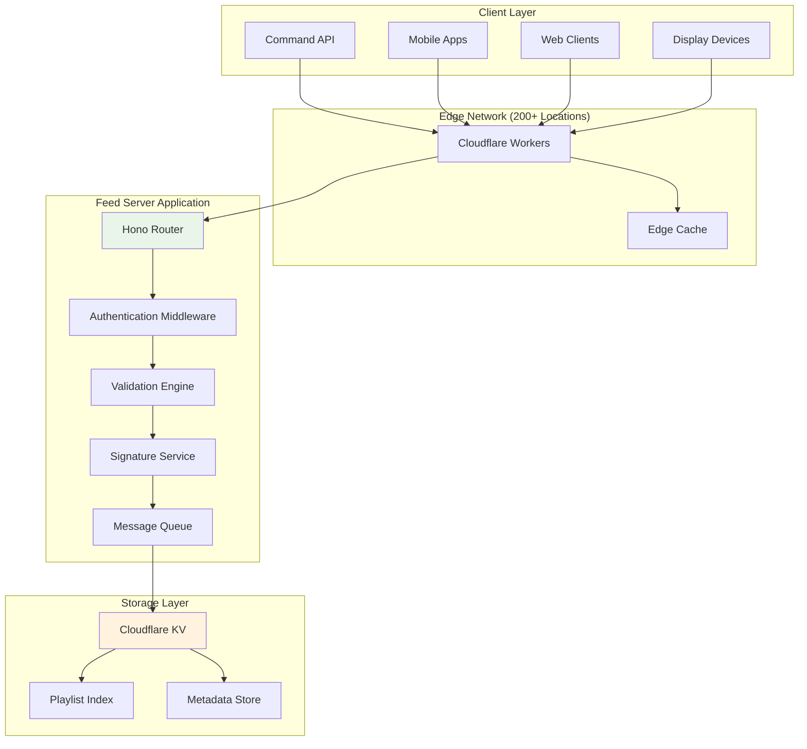

# DP-1 Feed Server

*A comprehensive guide to Feral File's hosted DP-1 Feed Server – your central registry for playlist storage, validation, and distribution in the Display Protocol ecosystem*

---

## Overview

Feral's DP-1 Feed Server is the production backbone for our digital art playlists, running at [feed.feralfile.com](https://feed.feralfile.com). It bridges content creation (think AI commands or manual curation) and playback on FF1 devices or other clients, all while enforcing DP-1 standards for smooth, tamper-proof delivery.

This guide zooms in on our hosted instance—endpoints, auth, and workflows tailored to Feral exhibitions. For the open-source implementation details (like building your own), check out the [dp1-feed repo](https://github.com/display-protocol/dp1-feed).

**Key Functions:**

- **Playlist Registry**: Stores and indexes DP-1 compliant playlists with unique IDs
- **Schema Validation**: Checks everything against DP-1 specs before saving
- **Cryptographic Security**: Signs playlists with Ed25519 for authenticity
- **Global Distribution**: Low-latency access via Cloudflare's edge network
- **API Gateway**: RESTful endpoints for CRUD on playlists

### Role in the Feral Ecosystem



---

## Technical Architecture

Our setup leverages edge-optimized tech for speed and scale—built on [Hono](https://hono.dev/) in Cloudflare Workers, with KV for storage. (Dive deeper into the stack in the [dp1-feed repo](https://github.com/display-protocol/dp1-feed) if you're forking this.)

### System Architecture



### Data Flow

1. **Playlist Submission**: POST to `/playlists` with your payload
2. **Authentication**: We check your API key
3. **Schema Validation**: Runs against DP-1 rules
4. **Cryptographic Signing**: Adds an Ed25519 signature
5. **Immediate Response**: You get the signed playlist back right away
6. **Asynchronous Persistence**: Background queue saves to KV *(experimental—keeps things snappy)*
7. **Global Distribution**: Edges cache it for fast fetches worldwide
8. **Retrieval**: GET by ID or slug

**Performance Note:** That async queue? It's our trick for handling big playlists without blocking—players start rendering instantly.

---

## API Reference

Base URL: `https://feed.feralfile.com/api/v1`

All endpoints return JSON and follow HTTP norms. Write ops need auth; reads are public.

### Authentication

Feral API keys are issued via the [Command API](../api-reference/command-api.md) for seamless exhibition workflows. Keys respect our [rate limits](../api-reference/auth-rate-limits.md)—fair use for exhibitions. Slap 'em in the `Authorization` header:

```bash
curl -H "Authorization: Bearer your-api-key-here" \
     -H "Content-Type: application/json" \
     -X POST https://feed.feralfile.com/api/v1/playlists \
     -d @playlist.json
```

### Endpoints

#### Create Playlist

**POST** `/playlists`

Submit a new one—we validate, sign, and store it.

**Request Body Example:**
```json
{
  "dpVersion": "1.0.0",
  "title": "Digital Art Showcase",
  "defaults": {
    "display": {
      "scaling": "contain",
      "background": "#000000",
      "margin": 0
    }
  },
  "items": [
    {
      "duration": 30,
      "license": "open",
      "source": "ipfs://cid",
      "provenance": {
        "type": "onChain",
        "contract": {
          "chain": "ethereum",
          "standard": "ERC-721",
          "address": "0x...",
          "tokenId": "1"
        }
      }
    }
  ]
}
```

**Response (201 Created):**
```json
{
  "dpVersion": "1.0.0",
  "id": "d241c5ad-a5e0-451e-89ec-de442811a869",
  "slug": "digital-art-showcase-ds2",
  "title": "Digital Art Showcase",
  "created": "2025-08-11T08:49:14.454Z",
  "defaults": {
    "display": {
      "scaling": "contain",
      "background": "#000000",
      "margin": 0
    }
  },
  "items": [
    {
      "duration": 30,
      "license": "open",
      "source": "ipfs://cid",
      "provenance": {
        "type": "onChain",
        "contract": {
          "chain": "ethereum",
          "standard": "ERC-721",
          "address": "0x...",
          "tokenId": "1"
        }
      },
      "id": "732dc2a2-9597-4b91-b4b1-debc761f7fdd",
      "created": "2025-09-04T09:23:25.526Z"
    }
  ],
  "signature": "ed25519:0xabc..."
}
```

**Errors:** 400 (bad format), 401 (auth fail, e.g., `{"error": "auth_error", "message": "Invalid API key"}`), 500 (server hiccup).

#### Replace Playlist

**PUT** `/playlists/{id}`

Overwrite an existing one—same validation and signing.

**Request Body:** Same as Create.

**Response (200 OK):** Full updated playlist JSON.

**Errors:** Same as above.

#### Update Playlist

**PATCH** `/playlists/{id}`

Tweak fields like title or defaults—can't touch protected stuff like IDs.

**Request Body Example:**
```json
{
  "title": "Digital Art Showcase v2",
  "defaults": {
    "display": {
      "scaling": "contain",
      "background": "#000000",
      "margin": 0
    }
  }
}
```

**Response (200 OK):** Full updated playlist.

**Errors:** 400 (invalid updates), plus the usual.

#### Retrieve Playlist

**GET** `/playlists/{id}`

Grab by UUID or slug.

**Response (200 OK):** Full playlist JSON.

**Errors:** 400 (bad ID), 404 (not found), 500.

#### List Playlists

**GET** `/playlists`

Paginated metadata list.

**Query Params:**

- `limit` (opt, default 100, max 100)
- `cursor` (opt, for next page)
- `sort` (opt, `asc`/`desc` by created, default `asc`)

**Response (200 OK):**
```json
{
  "playlists": [
    {
      "dpVersion": "1.0.0",
      "id": "d241c5ad-a5e0-451e-89ec-de442811a869",
      "slug": "digital-art-showcase-ds2",
      "title": "Digital Art Showcase",
      "created": "2025-08-11T08:49:14.454Z",
      "items": [ /* abbreviated */ ],
      "signature": "ed25519:0xabc..."
    }
  ],
  "cursor": "next-cursor-here",
  "hasMore": true
}
```

#### Health Check

**GET** `/health`

Quick status ping.

**Response (200 OK):**
```json
{
  "status": "healthy",
  "timestamp": "2025-09-08T07:36:30.348Z",
  "version": "1.0.0",
  "environment": "production",
  "runtime": "cloudflare-worker"
}
```

---

## Implementation Details

### Playlist Validation

We run full checks on every submit to keep things DP-1 compliant.

#### Validation Rules (Feral Flavor)

**Playlist Level:**

- `dpVersion` must match supported versions (e.g., "1.0.0")
- At least one item in `items`
- Display defaults must be sane

**Item Level:**

- `duration` > 0 seconds
- `license` in ["open", "token", "subscription"]
- Provenance must link to valid chains if on-chain

Errors come back detailed, like:
```json
{
  "error": "validation_error",
  "message": "items.0.source required; duration >=1; license invalid"
}
```

### Cryptographic Signing

Every playlist gets signed for trust—no tampering allowed.

**How It Works:**

1. Canonical JSON (per [RFC 8785](https://www.rfc-editor.org/rfc/rfc8785))
2. SHA-256 hash
3. Ed25519 sign with our private key
4. Encode as `ed25519:<hex>`

Verify on your end by stripping signature, hashing, and checking against our public key (from the repo).

### Storage Architecture

Cloudflare KV handles the heavy lifting—global, replicated, no TTLs for permanence.

**Keys:** `playlist:{id}` or `playlist:{slug}` for full data; indexed by timestamp for lists.

---

## Development & Deployment

Want to run your own? The [dp1-feed repo](https://github.com/display-protocol/dp1-feed) has Cloudflare Workers and Node.js guides. For Feral-specific tweaks, hit up our [contribute.md](contribute.md).

---

## Conclusion

Feral's Feed Server makes DP-1 feel effortless—create, validate, distribute, done. It's the glue for your exhibitions, keeping art flowing securely to FF1s and beyond.

### Key Takeaways
- **Hosted & Ready**: Plug into `feed.feralfile.com` today
- **Secure by Default**: Signatures + validation = peace of mind
- **Scales Globally**: Edge caching handles the load
- **Open Roots**: Build on our public impls

### Next Steps
1. Grab an API key from [Command API](../api-reference/command-api.md)
2. Test a playlist POST
3. Check [Player Behavior](player-behavior.md) for FF1 rendering tips

For protocol deep dives, head to [DP-1 spec](https://github.com/display-protocol/dp1/blob/main/docs/spec.md).
