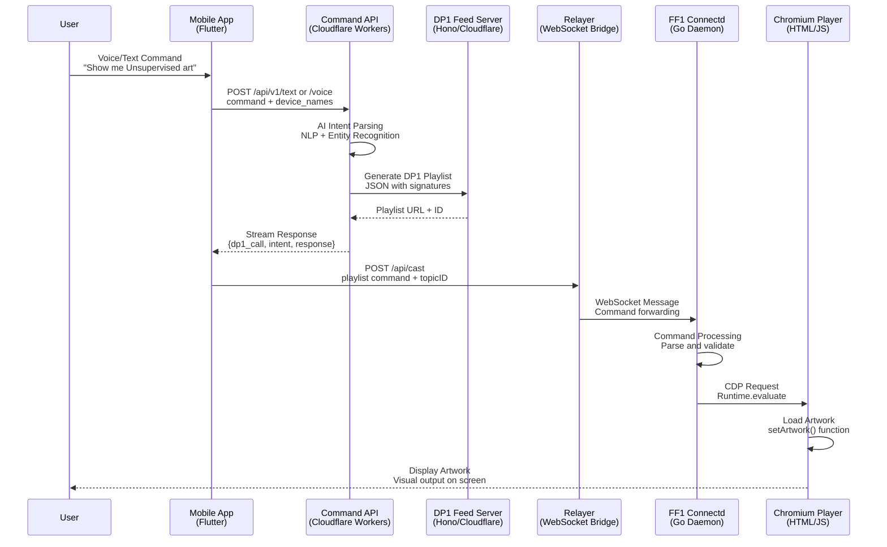

# FF1 AI-First Playlist Creation and Display Flow

*A complete technical documentation of how users create playlists through AI commands and display them on FF1 devices*

---

## Overview

The FF1 ecosystem enables users to create and display artwork playlists through natural language commands (voice or text). The system processes these commands through AI to generate DP-1 compliant playlists, stores them in a distributed feed system, and delivers them to FF1 devices for display.

---

## Architecture Components

### Core Services
- **Mobile App** (`feralfile-app`) - Flutter-based mobile controller
- **Command API** (`ff-cloud-command-service`) - AI-powered command processing service  
- **DP1 Feed Server** (`dp1-feed`) - Playlist storage and distribution
- **Relayer** (`ff1-relayer`) - WebSocket bridge between mobile and device
- **Device OS** (`feralfile-device`) - FF1 device firmware and services
- **Display Engine** (`player-wrapper-ui`) - Chromium-based artwork renderer

---

## Complete Flow Diagram

---

## Detailed Flow Steps

### 1. User Command Input

Users interact with the mobile app through natural language commands using either:

#### Text Commands
Users type commands like "show me unsupervised art" or "display Refik Anadol's work" into a text input field. The interface provides immediate feedback and command history.

#### Voice Commands  
Users speak commands naturally through a microphone button. Voice input is captured as audio files and processed for speech-to-text transcription before command parsing.

Both input methods support the same natural language processing capabilities and result in identical downstream processing.

### 2. AI Command Processing

The Command API receives user commands and processes them through sophisticated AI systems:

#### Intent Parsing
Natural language commands are analyzed to extract:
- **Artist names** - Fuzzy matching handles variations in spelling and aliases
- **Artwork titles** - Semantic understanding of partial or informal references  
- **Action types** - Commands like "show", "display", "play", "find"
- **Duration preferences** - Time-based filtering for playlist length
- **Style attributes** - Genre, medium, or aesthetic descriptors

#### Voice Transcription
Audio commands are processed using OpenAI Whisper for accurate speech-to-text conversion, with domain-specific training for art and artist terminology.

#### Entity Resolution
Parsed entities are matched against comprehensive databases of artworks, artists, and collections using vector similarity and fuzzy string matching algorithms.

### 3. DP-1 Playlist Generation

Based on the processed command, the system generates standardized DP-1 playlists:

#### Playlist Structure
Each playlist follows the DP-1 specification with:
- **Metadata** - Title, creation timestamp, unique identifiers
- **Display Defaults** - Scaling mode, background color, margin settings
- **Playlist Items** - Ordered list of artworks with individual timing and display preferences
- **Digital Signatures** - Ed25519 cryptographic signatures for authenticity
- **Licensing Information** - Access control (open, token-gated, subscription)

#### Content Curation
The AI system selects appropriate artworks based on:
- User intent and preferences
- Artwork compatibility with display devices
- Licensing and access permissions
- Optimal viewing sequences and timing

### 4. Playlist Storage and Distribution

Generated playlists are stored in the DP-1 Feed Server system:

#### Secure Storage
- **Cryptographic Signing** - All playlists receive Ed25519 signatures for tamper-proof authenticity
- **Distributed Storage** - Cloudflare KV provides global edge storage for low-latency access
- **Schema Validation** - Strict adherence to DP-1 specification ensures compatibility

#### Access Control
- **API Authentication** - Bearer token authentication for write operations
- **Content Addressing** - Immutable playlist URLs enable reliable sharing and caching
- **Licensing Enforcement** - Token-gated and subscription-based access controls

### 5. Command Relay to Device

The mobile app communicates with FF1 devices through a secure relay system:

#### Secure Routing
- **HMAC Authentication** - Topic-based message routing with cryptographic verification
- **Device Targeting** - Commands are routed to specific devices using unique identifiers
- **Real-time Communication** - WebSocket connections provide immediate command delivery

#### Message Structure
Commands include:
- **Device identification** - Target device selection and verification
- **Playlist references** - URLs or identifiers for DP-1 playlists to display
- **Display preferences** - User-specified overrides for scaling, timing, or interaction

### 6. Device Command Processing

FF1 devices receive and process commands through the connectd daemon:

#### Command Validation
- **Authentication** - Verify command authenticity and authorization
- **Compatibility** - Ensure device capabilities match playlist requirements
- **Resource Management** - Check available storage, bandwidth, and processing capacity

#### Playlist Preparation
- **Asset Fetching** - Download required artwork files and dependencies
- **Signature Verification** - Validate DP-1 playlist signatures before rendering
- **Display Configuration** - Apply user preferences and device-specific settings

### 7. Artwork Rendering and Display

The final step involves rendering artworks through the device's display engine:

#### Multi-Format Support
The Chromium-based player handles diverse artwork types:
- **Static Images** - PNG, JPEG, SVG with proper scaling and positioning
- **Video Content** - MP4, WebM with streaming and loop support
- **Interactive Code** - HTML5, WebGL, WebAssembly for generative and interactive art
- **Audio Elements** - Background soundtracks and audio-reactive components

#### Display Modes
- **Fit Mode** - Preserves aspect ratio with letterboxing if needed
- **Fill Mode** - Fills entire screen, cropping content if necessary  
- **Custom Scaling** - Artist-specified display preferences and interaction settings

#### Real-time Features
- **Automatic Progression** - Timed transitions between playlist items
- **Interactive Elements** - Keyboard and mouse input for interactive artworks
- **Performance Monitoring** - Frame rate and resource usage tracking

---

## Data Flow Summary

1. **User Input** → Mobile app captures voice/text commands
2. **AI Processing** → Command API parses intent and generates playlists  
3. **Storage** → DP1 Feed Server stores signed playlists
4. **Routing** → Relayer forwards commands to specific FF1 devices
5. **Device Processing** → Connectd daemon handles commands via CDP
6. **Display** → Chromium player renders artwork on screen

---

## Security & Authentication

### API Security
- **API Keys** - Bearer token authentication for Command API
- **HMAC Signatures** - Topic-based routing with cryptographic verification
- **Ed25519 Signatures** - Playlist authenticity and tamper protection

### Device Security  
- **Device Pairing** - Secure BLE-based device registration
- **Signed Heartbeats** - Regular device health reporting with signatures
- **Read-only Root** - Immutable system with OTA update capability

---

## Error Handling & Recovery

### Command Processing Errors
- **Invalid Intent** - Fallback to clarification requests
- **Network Issues** - Retry logic with exponential backoff
- **Playlist Validation** - Signature verification before display

### Device Communication Errors  
- **Connection Loss** - Automatic reconnection with state preservation
- **CDP Failures** - Watchdog system with automatic restart
- **Display Issues** - Fallback to default content

---

## Performance Optimizations

### Streaming Response
- **NDJSON Streaming** - Progressive command processing feedback
- **Parallel Processing** - Concurrent playlist generation and validation
- **Edge Computing** - Cloudflare Workers for global latency reduction

### Caching Strategy
- **KV Storage** - Cloudflare KV for playlist caching
- **CDN Distribution** - Global artwork asset distribution  
- **Device Caching** - Local artwork caching on FF1 devices

---

This architecture enables seamless, AI-driven playlist creation and display, providing users with an intuitive way to control their FF1 devices through natural language while maintaining security, performance, and reliability.