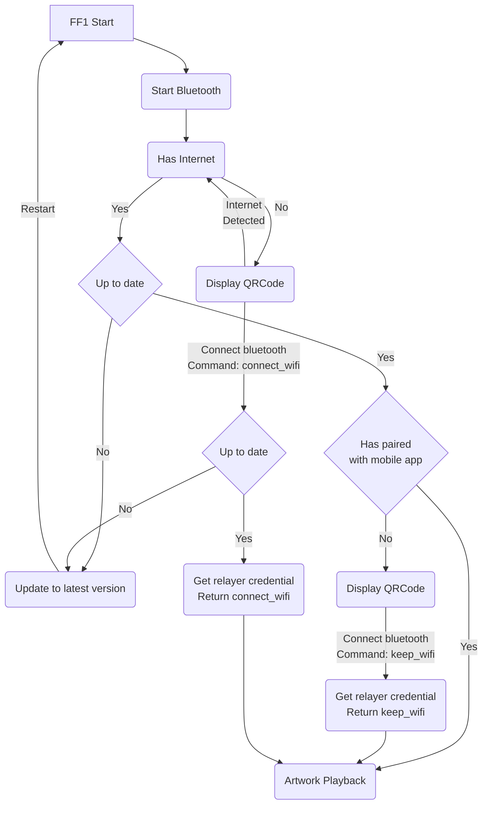
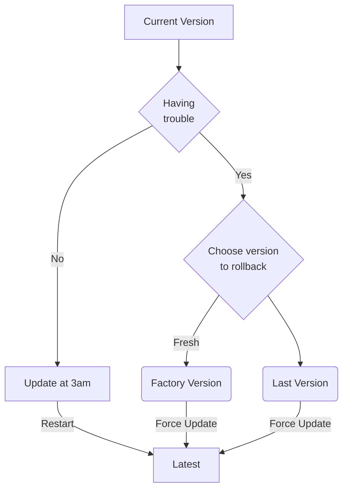
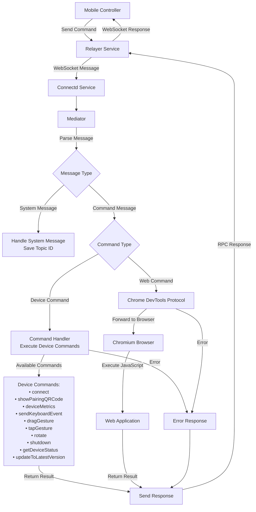

# FF1 Device life cycle

## App flows

### App startup

### App update

### Command Processing Flow

## Telemetry (Heartbeat)

All the events should only consider network connected scenario otherwise it can't be sent over heartbeat.

### Device status
| Field | Type | Description |
| :--- | :--- | :--- |
| `Timestamp` | DateTime | The ISO 8601 timestamp (UTC) when the heartbeat was generated. |
| `MAC Address` | String | The unique, immutable MAC address of the network interface. |
| `Build` | String | The current firmware build version (e.g., "develop-0.0.1"). |
| `Screen Info` | String | String detailing screen status (e.g., "1920x1080@60"). |
| `CPU Temp` | Number | The core CPU temperature in Celsius (°C). **Alerts if > 55.** |
| `CPU Usage` | Percent | The current CPU utilization (0.00 to 1.00). **Alerts if > 0.80.** |
| `GPU Usage` | Percent | The current GPU utilization (0.00 to 1.00). **Alerts if > 0.80.** |
| `Memory Usage`| Percent | The percentage of total RAM currently in use (0.00 to 1.00). **Alerts if > 0.80.** |
| `Disk Usage` | Percent | The percentage of total disk storage currently in use (0.00 to 1.00). **Alerts if > 0.80.** |
| `Uptime` | String | The duration the device has been running since last boot, in "D H:M:S" format. |
| `Status` | String | **(Calculated)** "✅ Online" or "❌ Offline". Derived in the spreadsheet, not sent by device. |
| `Public Key` | String | The device's public key for signature verification. |
| `Signature` | String | The payload's cryptographic signature for data integrity. |
| `Page` | String | The setupd page state. |
| `Page Uptime` | String | The duration the setupd has been staying under this state page, in "D H:M:S" format. |

### Setupd pages

| Name | Notes |
| :- | :- |
| `QRCode` | QR code displayed for pairing setup. Network already connected. |
| `FactoryReset` | Device initiated rollback to factory version. |
| `SystemUpgrade` | Force firmware update initiated |
| `WebApp` | Artwork playback has begun. |

## Version control

We deploy the firmware versions through 2 main channels:
- Dev channel: https://feralfile-device-distribution.bitmark-development.workers.dev/
- Prod channel: https://ff1.feral-file.workers.dev/

Our versioning follow Semantic Versioning format.

Each channel has API to specific min_version and latest_version. If the current version on the device is older than min_version, it's forced to update. Otherwise, it will update to the latest version silently at 3am.